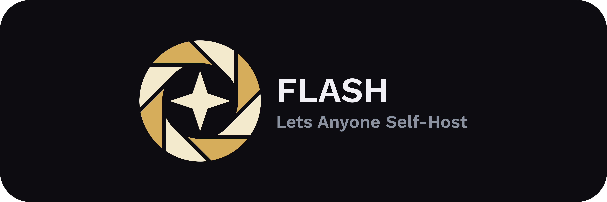

<div align="center">



</div>

<div align="center">


</div>

<div align="center">


</div>

## Table of Contents

- [Overview](#overview)
  - [Key Features](#key-features)
- [Architecture](#architecture)
  - [Tech Stack](#tech-stack)
  - [Monorepo Structure](#monorepo-structure)
- [Getting Started](#getting-started)
  - [Building the Docker Image](#building-the-docker-image)
  - [Running the Docker Image](#running-the-docker-image)
  - [Configuration](#configuration)
- [Development](#development)
  - [Requirements](#requirements)
  - [Tests](#tests)
    - [Test Overview](#test-overview)
    - [Running Tests](#running-tests)
  - [Running the Application](#running-the-application)

## Overview

### Key Features

| Creating an Event                                                                                     | Upload Images                                                                   | Moderation                                                                      |
| ----------------------------------------------------------------------------------------------------- | ------------------------------------------------------------------------------- | ------------------------------------------------------------------------------- |
|  | https://github.com/user-attachments/assets/c933fd44-e22e-41b6-97ac-8b1f5e5171b6 | https://github.com/user-attachments/assets/6ad24493-d9d1-4d86-a992-226d697174f3 |

## Architecture

### Tech Stack

- **Frontend**: React with TypeScript + vanilla CSS
- **Framework**: Next.js (handles both frontend rendering and API routes)
- **Backend**: Node.js (via Next.js API routes)
- **PWA** support: The app can be installed and used as a Progressive Web App
- **Storage**: Configurable through the file-storage package (local by default,
  optional cloud backends)
- **Testing/infrastructure**: Docker is used to run local instances of external
  services (e.g. storage) during testing

### Monorepo Structure

This project uses a monorepo structure where the main application and shared
functionality are split into separate packages:

| Package                                                 | Description                                                                                                                                                                                                                                                                                  |
| ------------------------------------------------------- | -------------------------------------------------------------------------------------------------------------------------------------------------------------------------------------------------------------------------------------------------------------------------------------------- |
| [**`website`**](./apps/website/README.md)               | The heart of `FLASH`. Built with Next.js, it contains both the React frontend and backend API routes. The frontend uses shared components from UI and styling from tokens. The backend provides endpoints for events, image handling, authentication, and admin functionality.               |
| [**`file-storage`**](./packages/file-storage/README.md) | Handles all file storage operations through a common interface (upload, retrieval, deletion). The application interacts with storage exclusively through this package. Uses local filesystem storage by default, with support for alternative backends configured via environment variables. |
| [**`UI`**](./packages/ui/README.md)                     | Shared React component library used by the frontend. Components are intended to be reusable and consistent across the application.                                                                                                                                                           |
| [**`tokens`**](./packages/tokens/README.md)             | Centralized TypeScript-first CSS design tokens (e.g. colors, spacing, typography) used by the UI components and frontend.                                                                                                                                                                    |

## Getting Started

FLASH can be self-hosted on any VPS capable of running Node.js. For ease of use
we provide a `Dockerfile` which packages all the dependencies needed for FLASH
to function. For building and running the application locally, see
[Running the Application](#running-the-application).

### Building the Docker Image

Currently we do not provide pre-built docker images, so you will have to build
one yourself. The only requirement is that your computer has `Docker` installed.

Building the docker image can be done by running:

```bash
pnpm docker
# or
docker build . -t flash # If `pnpm` is not available on your system
```

### Running the Docker Image

After the docker image is built, FLASH can be started using the following
command, where `<port>` is the port number you want to expose the application
on.

```bash
docker run -p <port>:3000 flash
```

Many of FLASH's features can be configured using environment variables, which
are described in more detail [below](#configuration). They can be passed to the
docker container using the `-e` flag. For example setting the administrator
password would look like this:

```bash
docker run -p <port>:3000 -e ADMIN_PASSWORD=1234 flash
```

Another useful `docker run` flag is `-v`, which shares a host folder with the
docker container. It can be used in conjunction with the `FS` storage to persist
events and images to a local folder on the host between container runs.

```bash
docker run -p <port>:3000 -e STORAGE_BACKEND=fs -e STORAGE_DIR=/srv/flash -v <local-folder>:/srv/flash flash
```

The full `docker run` documentation can be found
[here](https://docs.docker.com/reference/cli/docker/container/run/).

### Configuration

| Variable                    | Default Value                                           | Description                                                                                                                                                                                 |
| --------------------------- | ------------------------------------------------------- | ------------------------------------------------------------------------------------------------------------------------------------------------------------------------------------------- |
| `ADMIN_PASSWORD`            | `"Default"`                                             | The administrator password.                                                                                                                                                                 |
| `TOAST_DISPLAY_TIME`        | `5000` (5 seconds)                                      | The amount of time in milliseconds notification toasts stay on screen for.                                                                                                                  |
| `MULTI_FILE_UPLOAD`         | `false`                                                 | Whether or not to allow users to upload multiple images at once. `"true"` and `"1"` are accepted as truthy values.                                                                          |
| `SLIDESHOW_SLIDE_DURATION`  | `10000` (10 seconds)                                    | The amount of time in milliseconds before progressing to the next slide on the slideshow.                                                                                                   |
| `MAX_IMAGE_SIZE`            | `12582912` (12 MiB)                                     | The maximum image size in bytes that the user is allowed to upload.                                                                                                                         |
| `EVENT_REFETCH_INTERVAL`    | `120000` (120 seconds)                                  | The amount of time in milliseconds to wait before polling for changes in events.                                                                                                            |
| `PHOTOS_REFETCH_INTERVAL`   | `12000` (12 seconds)                                    | The amount of time in milliseconds to wait before polling for changes in images.                                                                                                            |
| `JWT_SECRET`                | `"SUPER_SECRET_KEY"`                                    | The secret key to use for JWT token encryption/decryption. Keep this private.                                                                                                               |
| `STORAGE_BACKEND`           | `"fs"`                                                  | Which storage backend to use. Currently one of `"fs"` or `"gcloud"`.                                                                                                                        |
| `STORAGE_DIR`               | `$tmp/flash` (N.B. The value of `$tmp` is OS-dependent) | Path to the directory to store the FLASH database in. Only relevant if `STORAGE_BACKEND="fs"`.                                                                                              |
| `GCP_BUCKET`                | -                                                       | The name of the Google Cloud Storage bucket to save store the FLASH database to. Required for `STORAGE_BACKEND="gcloud"`, ignored otherwise.                                                |
| `GCP_PROJECT_ID`            | -                                                       | The ID of the Google Cloud Storage project to use. Only required in conjunction with `GCP_SERVICE_ACCOUNT_EMAIL` and `GCP_PRIVATE_KEY`.                                                     |
| `GCP_SERVICE_ACCOUNT_EMAIL` | -                                                       | The email of the service account to use for authentication with the Google Cloud Storage project. Only required in conjunction with `GCP_PROJECT_ID` and `GCP_PRIVATE_KEY`.                 |
| `GCP_PRIVATE_KEY`           | -                                                       | The private key of the service account to use for authentication with the Google Cloud Storage project. Only required in conjunction with `GCP_PROJECT_ID` and `GCP_SERVICE_ACCOUNT_EMAIL`. |

Currently, two storage backends are supported; the local file system and Google
Cloud Storage. You can switch between them by setting the `STORAGE_BACKEND`
environment variable.

When using Google Cloud Storage, the environment variables `GCP_PROJECT_ID`,
`GCP_SERVICE_ACCOUNT_EMAIL` and `GCP_PRIVATE_KEY` can all be omitted in order to
authenticate using
[Application Default Credentials](https://docs.cloud.google.com/docs/authentication/provide-credentials-adc).
Otherwise, all three need to be provided.

## Development

### Requirements

- Node.js 20+
- Pnpm 10+

Project dependencies can be installed by running the following command:

```bash
pnpm install
```

Before the application or any tests can be run the local monorepo packages have
to be built with the following command:

```bash
pnpm build:packages
```

In order to run end to end tests Playwright browsers need to be installed as
well. This can be done like so:

```bash
pnpm --filter website exec playwright install
```

### Tests

FLASH includes a comprehensive test suite and a mix of testing strategies across
its packages to ensure reliability and correctness across all parts of the
application.

#### Test Overview

| Package            | Unit | Accessibility | Interaction | E2E |
| ------------------ | ---- | ------------- | ----------- | --- |
| **`Website`**      | ✓    |               |             | ✓   |
| **`file-storage`** | ✓    |               |             |     |
| **`tokens`**       | ✓    |               |             |     |
| **`UI`**           | ✓    | ✓             | ✓           |     |

#### Running Tests

To run all **unit** tests across all packages and the website, run

```bash
pnpm test                       # For all unit tests
pnpm --filter <workspace> test  # To run unit test for a specific workspace
```

To run **End-to-End** (E2E) tests for the `apps/website`, run

```bash
pnpm test:e2e
```

For storybook, the `test` command only runs the unit and interaction tests. For
visual and accessibility tests, start Storybook and use the UI to run the tests.

```bash
pnpm storybook
```

### Running the Application

After installing the dependencies and building the packages, you can start the
main application in development mode using this command:

```shell
pnpm dev
```

This will start a Next.js development server which compiles pages on-demand only
when accessed and automatically rebuilds pages when the code changes.

The application can also be built locally and started in production mode.

```bash
pnpm build # Builds every package along with the main application
# or
pnpm --filter website build # Builds only the main application (useful if you have run `pnpm build:packages` already)

pnpm start # Starts the production server
```
